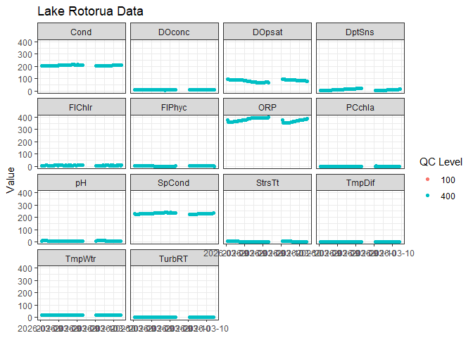

# ltapi 

The goal of ltapi is to provide a simple, consistent interface for
querying and accessing lake and water quality data from the
[LimnoTrack](https://limnotrack.com) database directly from R. It wraps
the LimnoTrack PostgREST API, handling authentication, error handling,
and response parsing so you can focus on your analysis.

## Installation

You can install the development version of ltapi from
[GitHub](https://github.com/limnotrack/ltapi) with:

``` r

# install.packages("pak")
pak::pak("limnotrack/ltapi")
```

## Example

A typical workflow starts by exploring what tables are available,
inspecting a table’s schema, and then fetching data with optional
filters.

### Explore available tables

``` r

library(ltapi)

# List all available tables in the LimnoTrack database
lt_tables()
#>  [1] "aeme_output"           "calibration_metadata"  "depth_contours"       
#>  [4] "forecast_ensembles"    "forecast_models"       "forecast_variables"   
#>  [7] "function_metadata"     "geography_columns"     "geometry_columns"     
#> [10] "lake_contours"         "lake_depth_points"     "lake_metadata"        
#> [13] "lake_shape_full_84"    "lake_shape_light"      "lake_shape_light_84"  
#> [16] "lernzmp_catchments"    "lernzmp_dem"           "lernzmp_lakes"        
#> [19] "lernzmp_lcdb"          "lernzmp_reaches"       "lernzmp_subcatchments"
#> [22] "met_data"              "parameter_metadata"    "raster_columns"       
#> [25] "raster_overviews"      "sensitivity_metadata"  "simulation_metadata"  
#> [28] "site_parameters"       "sites"                 "spatial_ref_sys"      
#> [31] "system_log"            "water_profile"         "weather_forecast"
```

### Inspect a table schema

Before fetching data it can be useful to check the available columns,
their types, and descriptions:

``` r

lt_schema("lernzmp_lakes")
#> # A tibble: 15 × 4
#>    column     type    format                             description
#>    <chr>      <chr>   <chr>                              <chr>      
#>  1 id         integer integer                            <NA>       
#>  2 id_final   string  text                               <NA>       
#>  3 lernzmp_id string  text                               <NA>       
#>  4 name_final string  text                               <NA>       
#>  5 region     string  text                               <NA>       
#>  6 gm_type    string  text                               <NA>       
#>  7 depth_meas boolean boolean                            <NA>       
#>  8 elevation  number  double precision                   <NA>       
#>  9 z_max      number  double precision                   <NA>       
#> 10 z_mean     number  double precision                   <NA>       
#> 11 dv         number  double precision                   <NA>       
#> 12 v          number  double precision                   <NA>       
#> 13 source     string  text                               <NA>       
#> 14 area_ha    number  double precision                   <NA>       
#> 15 geom       string  public.geometry(MultiPolygon,2193) <NA>
```

### Fetch data

Use [`lt_fetch()`](reference/lt_fetch.md) with
[`lt_filter()`](reference/lt_filter.md) to query a specific lake:

``` r

wq <- lt_fetch(
  table  = "water_profile",
  filter = lt_filter(site_id == "Rotorua"),
  order  = "datetime.asc",
  limit = 1000
)

wq
#> # A tibble: 1,000 × 6
#>    site_id datetime            parameter   value qc_level qc_comment
#>    <chr>   <dttm>              <chr>       <dbl>    <int> <chr>     
#>  1 Rotorua 2026-03-09 21:04:16 Cond      206.         400 ""        
#>  2 Rotorua 2026-03-09 21:04:16 DOconc     NA          100 ""        
#>  3 Rotorua 2026-03-09 21:04:16 DOconc      8.39       400 ""        
#>  4 Rotorua 2026-03-09 21:04:16 DOpsat     92.5        400 ""        
#>  5 Rotorua 2026-03-09 21:04:16 DptSns      1          400 ""        
#>  6 Rotorua 2026-03-09 21:04:16 FlChlr      4.88       400 ""        
#>  7 Rotorua 2026-03-09 21:04:16 FlPhyc      3.45       400 ""        
#>  8 Rotorua 2026-03-09 21:04:16 ORP       379.         400 ""        
#>  9 Rotorua 2026-03-09 21:04:16 PCchla      0.706      400 ""        
#> 10 Rotorua 2026-03-09 21:04:16 pH          7.27       400 ""        
#> # ℹ 990 more rows
```

### Fetch spatial data

Tables with geometry columns are automatically returned as
[`sf`](https://r-spatial.github.io/sf/) objects:

``` r

contours <- lt_fetch(
  table  = "lake_contours",
  filter = lt_filter(lernzmp_id == "LID40188")
)

class(contours)
#> [1] "sf"         "data.frame"
```

### Plot

``` r

library(ggplot2)
#> Warning: package 'ggplot2' was built under R version 4.5.3

ggplot(wq, aes(x = datetime, y = value, colour = factor(qc_level))) +
  geom_point() +
  facet_wrap(~parameter) +
  labs(
    title = "Lake Rotorua Data",
    x     = NULL,
    y     = "Value",
    colour = "QC Level"
  ) +
  scale_x_datetime(date_labels = "%Y-%m-%d") +
  theme_bw()
#> Warning: Removed 125 rows containing missing values or values outside the scale range
#> (`geom_point()`).
```



## Filtering

[`lt_filter()`](reference/lt_filter.md) supports standard R comparison
operators and translates them into PostgREST query expressions:

``` r

# Single condition
lt_fetch("lernzmp_lakes", filter = lt_filter(z_max >= 5), limit = 5)
#> Simple feature collection with 5 features and 14 fields
#> Geometry type: MULTIPOLYGON
#> Dimension:     XY
#> Bounding box:  xmin: 1755087 ymin: 5414930 xmax: 1795036 ymax: 5440216
#> Projected CRS: NZGD2000 / New Zealand Transverse Mercator 2000
#>       z_max  source        v id depth_meas     region    area_ha elevation
#> 1  8.719000 LERNZmp 28317807  1       TRUE Wellington 651.795952  1.888864
#> 2 14.428886    <NA>       NA  2       TRUE Wellington  10.820019        NA
#> 3 14.804648    <NA>       NA  3       TRUE Wellington  21.311029        NA
#> 4  5.329407    <NA>       NA  7      FALSE Wellington   9.166009        NA
#> 5  9.622161    <NA>       NA  9       TRUE Wellington  10.586849        NA
#>   id_final   gm_type      name_final      dv   z_mean lernzmp_id
#> 1    LID 1 Shoreline           Onoke 1.49103 4.333430       LID1
#> 2    LID 3 Shoreline Kohangapiripiri      NA 8.452708       LID3
#> 3    LID 4 Shoreline     Kohangatera      NA 9.029223       LID4
#> 4  LID 299  Riverine            <NA>      NA 1.995162     LID299
#> 5  LID 301  Riverine            <NA>      NA 3.034766     LID301
#>                         geometry
#> 1 MULTIPOLYGON (((1779244 541...
#> 2 MULTIPOLYGON (((1755299 541...
#> 3 MULTIPOLYGON (((1755868 541...
#> 4 MULTIPOLYGON (((1794634 543...
#> 5 MULTIPOLYGON (((1794257 543...

# Multiple conditions
lt_fetch("lernzmp_lakes", filter = lt_filter(
  region == "Bay of Plenty",
  z_max    >= 50
))
#> Simple feature collection with 6 features and 14 fields
#> Geometry type: MULTIPOLYGON
#> Dimension:     XY
#> Bounding box:  xmin: 1892203 ymin: 5757318 xmax: 1935670 ymax: 5787533
#> Projected CRS: NZGD2000 / New Zealand Transverse Mercator 2000
#>     z_max  source          v   id depth_meas        region   area_ha elevation
#> 1  89.134 LERNZmp  484880049  633       TRUE Bay of Plenty 1047.4205  318.4144
#> 2  52.100 LERNZmp         NA  639       TRUE Bay of Plenty  218.0935        NA
#> 3 101.303 LERNZmp 1207285318 1219       TRUE Bay of Plenty 3373.5409  283.2226
#> 4  84.794 LERNZmp  524435311 1220       TRUE Bay of Plenty 1073.5467  311.2037
#> 5  94.291 LERNZmp 2490510485 1221       TRUE Bay of Plenty 4120.8868  300.7707
#> 6 125.195 LERNZmp  580255331 1222       TRUE Bay of Plenty  903.0982  347.0145
#>    id_final  gm_type name_final       dv   z_mean lernzmp_id
#> 1 LID 40102 Volcanic     Rotoma 1.553606 46.15969   LID40102
#> 2 LID 40124      Dam   Matahina       NA 35.95600   LID40124
#> 3 LID 54730 Volcanic    Rotoiti 1.057013 35.69286   LID54730
#> 4 LID 54731 Volcanic   Okataina 1.720673 48.63426   LID54731
#> 5 LID 54732 Volcanic   Tarawera 1.919400 60.32738   LID54732
#> 6 LID 54733 Volcanic Rotomahana 1.532338 63.94700   LID54733
#>                         geometry
#> 1 MULTIPOLYGON (((1915076 578...
#> 2 MULTIPOLYGON (((1935526 576...
#> 3 MULTIPOLYGON (((1896018 578...
#> 4 MULTIPOLYGON (((1896494 577...
#> 5 MULTIPOLYGON (((1895719 576...
#> 6 MULTIPOLYGON (((1898882 575...

# Set membership
lt_fetch("lake_metadata", filter = lt_filter(
  id %in% c("LID40188", "LID40189")
))
#> # A tibble: 2 × 7
#>   name    id       latitude longitude elevation depth    area
#>   <chr>   <chr>       <dbl>     <dbl>     <dbl> <dbl>   <int>
#> 1 Rotoehu LID40188    -38.0      177.      303.  22.7 7965248
#> 2 Rotoehu LID40188    -38.0      177.      303.  22.7 7965248

# Null checks
lt_fetch("water_profile", filter = lt_filter(
  !is.na(value)
))
#> # A tibble: 1,000 × 6
#>    site_id  datetime            parameter    value qc_level qc_comment
#>    <chr>    <dttm>              <chr>        <dbl>    <int> <chr>     
#>  1 Karapiro 2026-03-10 16:35:47 FlChlr       7.49       400 ""        
#>  2 Karapiro 2026-03-10 16:35:47 FlChlr_AVG   7.49       400 ""        
#>  3 Karapiro 2026-03-10 16:35:47 FlChlr_MED   6.79       400 ""        
#>  4 Karapiro 2026-03-10 16:35:47 FlChlr_STDEV 1.43       400 ""        
#>  5 Karapiro 2026-03-10 16:35:47 FlPhyc       2.72       400 ""        
#>  6 Karapiro 2026-03-10 16:35:47 FlPhyc_AVG   2.72       400 ""        
#>  7 Karapiro 2026-03-10 16:35:47 FlPhyc_MED   2.66       400 ""        
#>  8 Karapiro 2026-03-10 16:35:47 FlPhyc_STDEV 0.158      400 ""        
#>  9 Karapiro 2026-03-10 16:35:47 fDOM_AVG     9.63       400 ""        
#> 10 Karapiro 2026-03-10 16:35:47 fDOM_MED     9.64       400 ""        
#> # ℹ 990 more rows
```

| Operator | PostgREST equivalent |
|----|----|
| `==` | `eq` |
| `!=` | `neq` |
| `>` / `>=` | `gt` / `gte` |
| `<` / `<=` | `lt` / `lte` |
| `%in%` | `in` |
| [`is.na()`](https://rdrr.io/r/base/NA.html) / `!is.na()` | `is.null` / `not.is.null` |

## Caching

The package caches the API schema in memory for the duration of your R
session, so repeated calls to [`lt_tables()`](reference/lt_tables.md),
[`lt_schema()`](reference/lt_schema.md), or
[`lt_fetch()`](reference/lt_fetch.md) do not re-download the schema. To
force a fresh fetch (e.g. after a database update):

``` r

lt_cache_reset()
```
